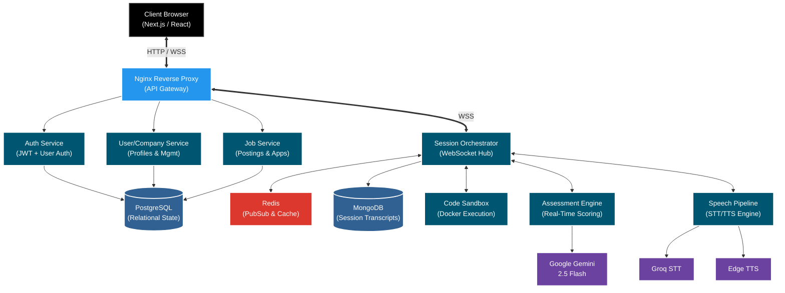

<div align="center">
  
# 🚀 SynthHire
**The Ultimate AI-Powered Semi-Auto Apply Job Portal & Interview Platform**

> 🎯 Practice interviews with AI personas that push back.  
> 📄 Beat ATS filters before you even hit apply.  
> ⚡ Semi-auto apply to jobs in minutes, not hours.  

[](https://fastapi.tiangolo.com/)
[](https://nextjs.org/)
[](https://www.docker.com/)
[](https://www.postgresql.org/)
[](https://www.mongodb.com/)
[](https://redis.io/)
[](https://opensource.org/licenses/MIT)


</div>

---

## 🎬 See It In Action

| Career Command Center | Interview Room | ATS Scorer |
|:---:|:---:|:---:|
|  |  |  |

---

## ✨ Feature Overview

| Feature | Description | Powered By |
|---|---|---|
| 📄 **Resume ATS Scorer** | Parses & grades resumes against benchmarks | Gemini 2.5 Flash |
| 🎤 **AI Interview Simulation** | Voice interviews with 5 AI personas | Groq STT + Edge TTS |
| 🔗 **LinkedIn Optimizer** | Keyword & headline suggestions | Gemini 2.5 Flash |
| ⚡ **Semi-Auto Job Apply** | Cover letters from job descriptions | Gemini 2.5 Flash |
| 📚 **Prep Hub** | Flashcards, DSA warm-ups, cheat sheets | LLM-generated |
| 💻 **Live Code Execution** | Run 5 languages in sandboxed env | Docker-in-Docker |
| 📊 **8D Assessment Engine** | Scores 8 dimensions in real-time | Custom LLM Pipeline |

---

## 🎤 AI Personas

| Persona | Warmth | Probing Style | Interaction Tone |
|---|---|---|---|
| **Kind Mentor** | High | Frequent hints | Supportive and encouraging |
| **Tough Lead** | Low | Deep, rigorous probing | High standards, expects optimal solutions |
| **Tricky HR** | Medium | Tests emotional intelligence | Casual, looks for conflict resolution skills |
| **Silent Observer**| Low | Minimal interaction | High pressure, tests composure |
| **Collaborative Peer**| High | Brainstorms with you | Friendly and cooperative |

---

## 📊 8-Dimensional Assessment Engine
Stop guessing how you did. Get real-time, objective scoring across 8 vectors:
1. Technical Correctness 
2. Problem Decomposition 
3. Communication Clarity 
4. Handling Ambiguity 
5. Edge Case Awareness 
6. Time Management 
7. Collaborative Signals 
8. Growth Mindset

---

## 💻 The Advanced Interview Room
- **Multi-Layout Interface**: Seamlessly drag and split your view between *Default*, *Code*, *Chat*, and *Code+Chat* layouts.
- **Live Monaco Code Editor**: Built-in syntax highlighting and autocomplete.
- **Real-Time Code Execution**: Run Python, JavaScript, Java, C++, and Go instantly via securely sandboxed remote execution environments.
- **Screen Sharing**: Built-in screen casting for system design rounds. 

---

## 🏗️ System Architecture

SynthHire is structured as a highly scalable microservices architecture capable of handling long-running, stateful WebSocket connections for live interview sessions.



### Component Breakdown
- **Gateway Layer**: Nginx acts as the reverse proxy, intelligently routing stateless HTTP traffic to standard microservices while maintaining stateful, persistent WebSocket (WSS) tunnels specifically to the Orchestrator.
- **Session Orchestrator**: The "brain" of the platform. Maintains the real-time WebSocket connection for live coding events, synchronizes the chat state via Redis PubSub, and coordinates the AI subsystems.
- **Assessment Engine**: Passes streaming user chat context and code execution output through Google Gemini to calculate the 8-dimensions of performance.
- **Code Sandbox**: A secure Docker-in-Docker isolated environment that compiles and runs candidate code instantly without exposing the host OS to malicious attempts.

---

## 🛠️ Tech Stack

| Layer | Technology |
|---|---|
| **Frontend** | Next.js 14, TailwindCSS, Monaco Editor, WebRTC |
| **Backend** | FastAPI, Python 3.11, Microservices |
| **AI / ML** | Google Gemini 2.5 Flash, Groq STT, Edge TTS |
| **Databases** | PostgreSQL, MongoDB, Redis |
| **DevOps** | Docker Compose, Nginx, GitHub Actions |
| **Auth** | RSA-256 Asymmetric JWT (Zero-Trust) |

---

## 🚀 Deployment Guide

SynthHire is fully containerized. You do not need to configure ports or install local runtimes—Docker handles everything.

### 1. Environment Setup
Clone the repository and set up your environment keys.
```bash
git clone https://github.com/YourUsername/SynthHire-Interview-Platform.git
cd SynthHire-Interview-Platform/backend
cp .env.template .env
```
*(Ensure your `.env` contains the required keys for OpenAI, Groq, and database URIs).*

### 2. Generate RSA Keys
Generate secure cryptographic keys for internal microservice communication:
```bash
python scripts/generate_keys.py
```

### 3. Launch the Stack
Start the databases, cache layers, backend microservices, Next.js frontend, and Nginx reverse proxy in detached mode:
```bash
docker-compose up -d --build
```

### 4. Database Initialization
Once the containers are healthy, seed the initial database schema:
```bash
docker exec -it synthhire-auth python scripts/init_db.py
```

---

## 🗺️ Roadmap
- [x] WebRTC voice integration
- [x] 8-Dimension scoring engine
- [x] Live code execution (5 languages)
- [x] Semi-Auto Job Apply Portal
- [ ] Browser extension for accelerating semi-auto job applications
- [ ] Mobile application (iOS & Android)
- [ ] LeetCode-style problem bank
- [ ] Dedicated company portal to serve as a screening layer before physical interviews

---

## 🛡️ Security Posture
- **Zero-Trust Microservices**: All internal service-to-service calls require signed JWTs.
- **Pterodactyl-Style Execution**: Candidate code is executed in isolated, resource-capped, ephemeral containers preventing host-escape vulnerabilities.
- **Environment Isolation**: No hardcoded secrets. Strict separation of local, staging, and production `.env` files.

---

## 🤝 Contributing
PRs are welcome! Open an issue before submitting major changes.

---

## 📄 License

This project is licensed under the MIT License - see the LICENSE file for details.

⭐ **If SynthHire helped you, star the repo — it helps others discover it!**
